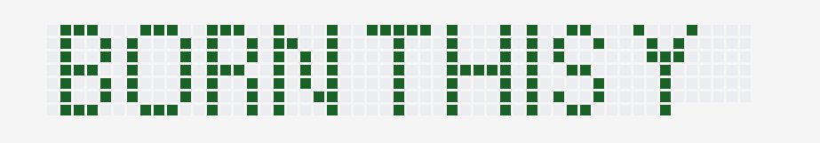

# Born project

The webapp was been developed by ChatGPT and adapted by the author.
Then the data has been painted by the author on the provided canvas.

Example of the result:

 (I missed a dot in the H :( ).

Go [here](https://github.com/Flecart?tab=overview&from=2002-12-01&to=2002-12-31) to check the results.

P.S. ChatGPT app was wrong... And it caused me 1 hour of debugging. So don't use it.